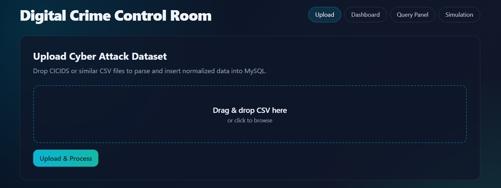
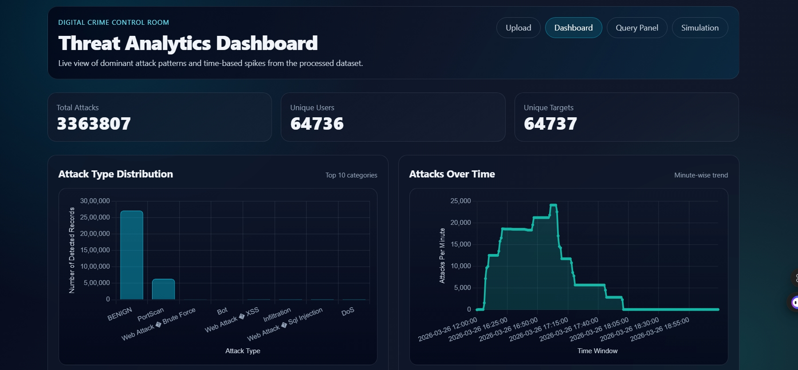
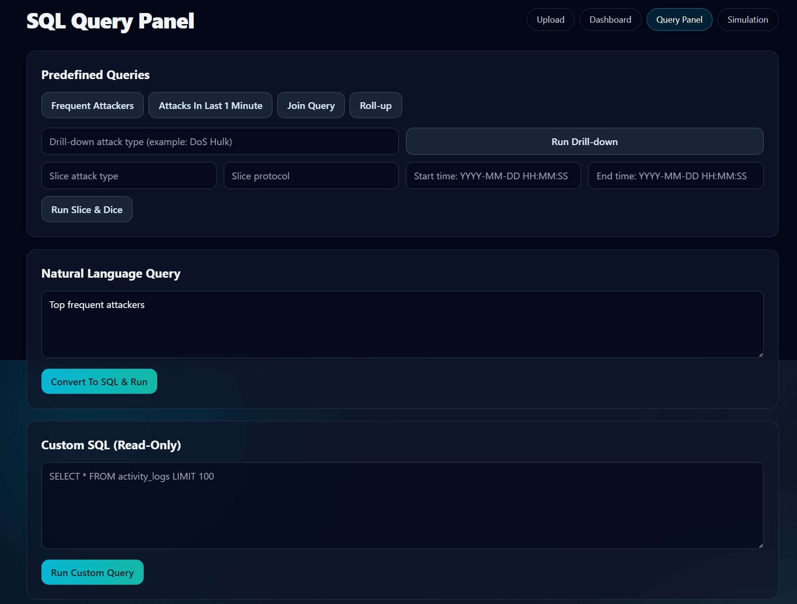
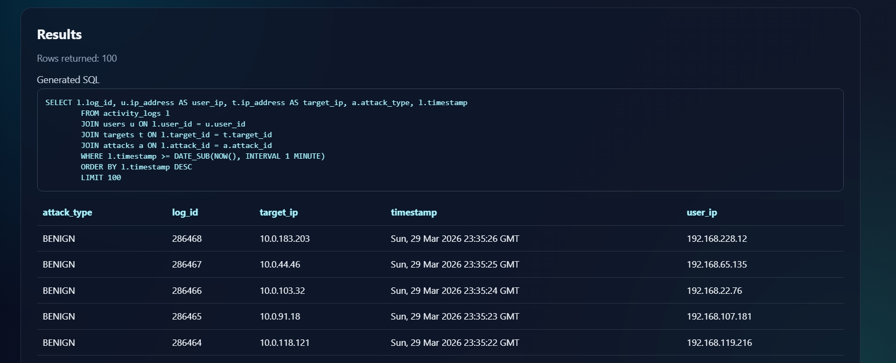
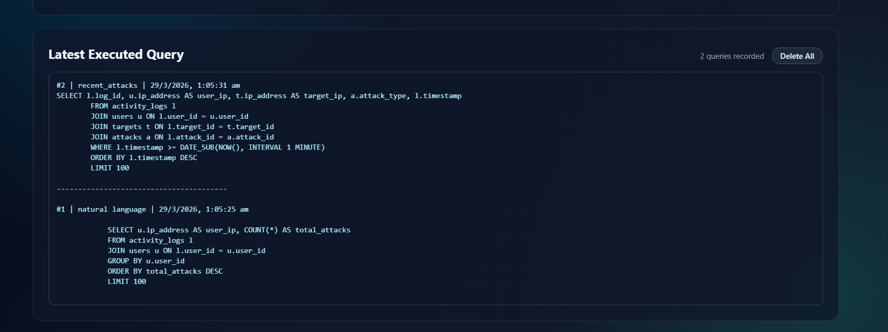
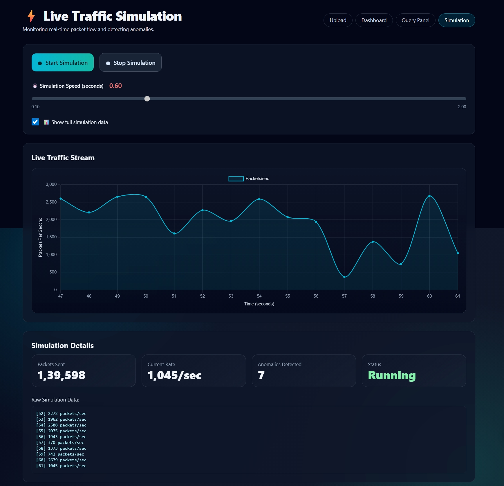
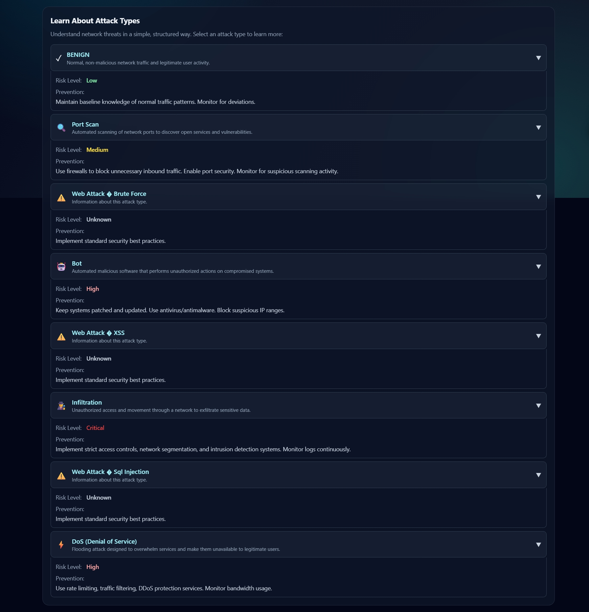

# 🛡️ Digital Crime Control Room

> A DBMS-powered web application for uploading, storing, querying, and visualizing cyber attack datasets (CICIDS and similar).


---

## 📌 Table of Contents

- [Overview](#overview)
- [Tech Stack](#tech-stack)
- [Features](#features)
- [Project Structure](#project-structure)
- [Database Design](#database-design)
- [Screenshots](#screenshots)
- [Installation](#installation)
- [Usage](#usage)
- [API Endpoints](#api-endpoints)
- [DBMS Concepts Demonstrated](#dbms-concepts-demonstrated)
- [Requirements](#requirements)

---

## 🔍 Overview

**Digital Crime Control Room** is a full-stack DBMS-based web application designed for cybersecurity analysis. It allows users to:

- Upload CICIDS/ISCX-style cyber attack CSV datasets
- Automatically parse and store data into a normalized MySQL database
- Run predefined and custom SQL queries
- Visualize attack patterns and trends via an interactive dashboard
- Simulate live network traffic and detect anomalies
- Explore DBMS concepts like normalization, indexing, transactions, and OLAP

---

## 🧰 Tech Stack

| Layer | Technology |
|-------|-----------|
| Backend | Python (Flask) |
| Database | MySQL |
| Frontend | HTML, Tailwind CSS, JavaScript |
| Data Processing | Pandas |
| Charts | Chart.js |
| AI Query | Anthropic Claude API (Natural Language → SQL) |

---

## ✨ Features

### 📁 1. File Upload System
- Drag-and-drop CSV upload interface
- Supports large files (tested with 55+ MB CICIDS datasets)
- CSV previewed in a scrollable table before processing
- Parsed using Pandas and inserted into MySQL with smart deduplication

### 🗄️ 2. Normalized Database (3NF)
- Data is split across four normalized tables
- No redundant user/target/attack entries
- Foreign key relationships maintained across all tables

### 🔍 3. SQL Query Panel
- **Predefined queries:** Frequent Attackers, Attacks in Last 1 Minute, Join Query, Roll-up
- **Drill-down:** Filter by specific attack type
- **Slice & Dice:** Filter by attack type, protocol, and time range
- **Natural Language Query:** Type in plain English → auto-converts to SQL using Claude AI
- **Custom SQL:** Read-only safe execution with results shown in a formatted table
- Query history log with timestamps

### 📊 4. Analytics Dashboard
- Live stats: Total Attacks, Unique Users, Unique Targets
- **Attack Type Distribution** – Bar chart (Top 10 categories)
- **Attacks Over Time** – Line chart (minute-wise trend)
- Attack type info panel with risk levels and prevention tips

### ⚡ 5. Live Traffic Simulation
- Real-time packet flow simulation with Chart.js line chart
- Adjustable simulation speed (0.10 – 2.00 seconds)
- Anomaly detection counter
- Live stats: Packets Sent, Current Rate (packets/sec), Status
- Raw simulation data stream log

### 📚 6. Learn About Attack Types
- Expandable accordion for each attack type (BENIGN, Port Scan, Bot, DoS, Infiltration, etc.)
- Shows Risk Level and Prevention tips for each

---

## 📁 Project Structure

```
digital-crime-control-room/
│
├── app.py                      # Main Flask application
├── database/
│   ├── schema.sql              # MySQL table definitions
│   └── db_config.py            # Database connection config
│
├── static/
│   ├── css/                    # Custom styles
│   └── js/                     # Frontend scripts
│
├── templates/
│   ├── index.html              # Upload page
│   ├── dashboard.html          # Analytics dashboard
│   ├── query.html              # SQL query panel
│   └── simulation.html         # Live traffic simulation
│
├── uploads/                    # Uploaded CSV files (gitignored)
├── utils/
│   ├── data_loader.py          # CSV → DB insert logic
│   └── query_executor.py       # Safe SQL execution wrapper
│
└── requirements.txt
```

---

## 🗃️ Database Design

### Entity-Relationship Overview

```
users ──────────────┐
                    │
targets ────────────┼──→ activity_logs
                    │
attacks ────────────┘
```

### Tables

#### `users`
| Column | Type | Constraint |
|--------|------|-----------|
| user_id | INT | PRIMARY KEY, AUTO_INCREMENT |
| ip_address | VARCHAR(45) | UNIQUE, NOT NULL |

#### `targets`
| Column | Type | Constraint |
|--------|------|-----------|
| target_id | INT | PRIMARY KEY, AUTO_INCREMENT |
| ip_address | VARCHAR(45) | UNIQUE, NOT NULL |

#### `attacks`
| Column | Type | Constraint |
|--------|------|-----------|
| attack_id | INT | PRIMARY KEY, AUTO_INCREMENT |
| attack_type | VARCHAR(100) | NOT NULL |
| protocol | VARCHAR(20) | |

#### `activity_logs`
| Column | Type | Constraint |
|--------|------|-----------|
| log_id | INT | PRIMARY KEY, AUTO_INCREMENT |
| user_id | INT | FOREIGN KEY → users |
| target_id | INT | FOREIGN KEY → targets |
| attack_id | INT | FOREIGN KEY → attacks |
| timestamp | DATETIME | |
| packets | BIGINT | |
| bytes | BIGINT | |

#### `attack_summary` (Data Warehouse)
| Column | Type | Description |
|--------|------|------------|
| attack_type | VARCHAR(100) | Attack category |
| total_count | BIGINT | Aggregated count via GROUP BY |

### Indexing
```sql
CREATE INDEX idx_user_time ON activity_logs(user_id, timestamp);
```

---

## 📸 Screenshots

### Upload Page

> Drag-and-drop CSV upload interface with file preview showing dataset columns and sample rows.

### Threat Analytics Dashboard

> Live stats (3.3M+ attacks, 64K+ unique users/targets), Attack Type bar chart, and Attacks Over Time line chart.

### SQL Query Panel

> Predefined query buttons, Natural Language Query with AI conversion, Drill-down, Slice & Dice filters, and Custom SQL input.

### Query Results

> Tabular results with generated SQL shown (e.g., recent attacks join query returning 100 rows with user/target IPs, attack type, and timestamp).

### Query History

> Logged executed queries with timestamps, query type labels (natural language / predefined), and full SQL display.

### Live Traffic Simulation

> Real-time packets/sec line chart, adjustable speed slider, anomaly counter, and raw data stream log.

### Learn About Attack Types

> Accordion panel showing BENIGN, Port Scan, Bot, DoS, Infiltration, and web attack types with Risk Level and Prevention guidance.

---

## 🚀 Installation

### Prerequisites
- Python 3.8+
- MySQL 8.0+
- Node.js (optional, for frontend tooling)

### Steps

```bash
# 1. Clone the repository
git clone https://github.com/yourusername/digital-crime-control-room.git
cd digital-crime-control-room

# 2. Create virtual environment
python -m venv venv
source venv/bin/activate        # Linux/Mac
venv\Scripts\activate           # Windows

# 3. Install dependencies
pip install -r requirements.txt

# 4. Set up MySQL database
mysql -u root -p
CREATE DATABASE crime_control_room;
USE crime_control_room;
SOURCE database/schema.sql;

# 5. Configure database connection
# Edit database/db_config.py:
# DB_HOST = "localhost"
# DB_USER = "your_mysql_user"
# DB_PASSWORD = "your_password"
# DB_NAME = "crime_control_room"

# 6. Run the application
python app.py
```

App will be running at `http://127.0.0.1:5000`

---

## 🧪 Usage

1. **Upload** – Go to the Upload page, drag and drop a CICIDS CSV file, click "Upload & Process"
2. **Dashboard** – View total attack counts, unique users/targets, charts for attack distribution and trends
3. **Query Panel** – Use predefined queries or type natural language/custom SQL to explore the data
4. **Simulation** – Run live traffic simulation to monitor real-time packet flow and anomaly detection

### Supported CSV Format
The app expects CICIDS/ISCX-style datasets with columns such as:
- `Source IP`, `Destination IP`
- `Protocol`
- `Label` (attack type, e.g., BENIGN, DoS, PortScan)
- `Timestamp`
- `Total Fwd Packets`, `Total Backward Packets`
- `Total Length of Fwd Packets`, `Total Length of Bwd Packets`

---

## 🌐 API Endpoints

| Route | Method | Description |
|-------|--------|-------------|
| `/` | GET | Upload page |
| `/upload` | POST | Handle CSV upload and DB insert |
| `/dashboard` | GET | Analytics dashboard |
| `/query` | GET | SQL query interface |
| `/run_query` | POST | Execute SQL query and return results |
| `/api/dashboard_data` | GET | JSON stats for charts |
| `/api/simulate` | GET | Live simulation data stream |

---

## 📐 DBMS Concepts Demonstrated

| Concept | Implementation |
|---------|---------------|
| **ER Model** | Four entities: users, targets, attacks, activity_logs with FK relationships |
| **Normalization (3NF)** | No transitive dependencies; IPs, attack types, protocols stored in separate tables |
| **Indexing** | `idx_user_time` on `(user_id, timestamp)` for fast time-range queries |
| **Transactions (ACID)** | `START TRANSACTION → INSERT → ROLLBACK/COMMIT` demonstrated in `data_loader.py` |
| **OLAP** | Roll-up (attack_summary), Drill-down (by attack type), Slice & Dice (multi-filter) |
| **Join Queries** | Multi-table JOINs across all four tables |
| **Aggregation** | GROUP BY, COUNT(*), ORDER BY for analytics |
| **Data Warehouse** | `attack_summary` table populated via GROUP BY queries |

---

## 📦 Requirements

```
flask
pandas
mysql-connector-python
anthropic
```

Install with:
```bash
pip install -r requirements.txt
```

---

## 📄 License

This project is developed for academic/educational purposes demonstrating DBMS concepts using real-world cybersecurity datasets.

---

## 🙌 Acknowledgements

- [CICIDS Dataset](https://www.unb.ca/cic/datasets/ids-2017.html) – Canadian Institute for Cybersecurity
- [Chart.js](https://www.chartjs.org/) – JavaScript charting library
- [Tailwind CSS](https://tailwindcss.com/) – Utility-first CSS framework
- [Anthropic Claude](https://www.anthropic.com/) – Natural language to SQL conversion

---

*Built as a DBMS course project demonstrating real-world application of database concepts.*